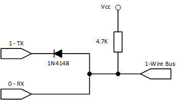

Known Limitations                       {#knownlimitations}
===============

Some sensors do not work seamlessly with a specific board. This means that they
are either incompatible or work only under specific settings. This is a list of
such sensors and known workarounds if they exist.

#### Grove Sensors

 * **RN2903** Click 2 version. This device will not work using the
 Edison UART on the Arduino breakout.  It does work on Edison using a
 USB->serial interface.
 * **Grove LCD RGB Backlit** (JHD1313M1) requires 5V and should be used with an
 external power supply connected to the board to function properly. Although
 some high powered USB ports might be enough, in most cases you will encounter
 dropped characters, washed out text and/or failed I2C writes while using USB
 power alone.
 * **Grove Servo** (ES08A) requires an external power supply connected to the
 board to work. We highly recommend using a separate circuit when powering any
 sort of motor. Trying to use this servo off USB power alone can lead to damage
 to the servo and/or board!
 * **Grove I2C Touch Sensor** (MPR121) v1.3 is incompatible with the Intel
 Edison using the Arduino board, but will work with the Mini-breakout if
 supplied with at least 4V. Revision v1.2 works well on all Intel boards.
 * **Grove Nunchuck** only works with the Intel Galileo boards and is unusable
 on the Intel Edison boards.
 * **Grove 3-Axis Digital Gyroscope** (ITG-3200) is not compatible with the
 Intel Edison Arduino board but will work with the Mini-breakout.
 * **Grove 3-Axis Digital Accelerometer +/-16g** (ADXL345) only works with the
 Intel Edison Arduino board when powered from the 3.3V line.
 * **Grove 3-Axis Digital Compass** (HMC5883L) reports inaccurate values at 5V
 on the Intel Edison Arduino board and newer revisions might not work at all.
 Use 3.3V or the Mini-breakout.
 * **Grove 96x96 OLED Display** will not work on the Intel Edison with Arduino
 breakout.
 * **Grove 128x64 OLED Display** will not work on the Intel Edison with Arduino
 breakout.
 * **Grove Barometer** (BMP085) has an unstable connection on the Intel Edison
 using the Arduino breakout and may drop read data. The Xadow version of this
 sensor (BMP180) is also dropping data packets occasionally.
 * **Grove 6-Axis Accelerometer & Compass** (LSM303) fails to write to the
 configuration register properly and returns invalid data.
 * **Grove I2C ADC Converter** does not show up on the I2C bus on the Intel
 Edison with the Arduino board.
 * **Grove I2C Motor Driver** is not compatible with the Intel Galileo due to
 the inability to change the I2C bus speed to 100 KHz.
 * **Grove Digital Light Sensor** (TSL2561) may have an unstable connection on
 the Intel Edison using the Arduino breakout that results in missed I2C reads.
 This is usually applicable when the I2C lines are pulled-up to 5V. Works as
 expected with the Mini-breakout.
 * **Grove CO2 Sensor** will return zeroed data and is unusable on the Intel
 Galileo.
 * **Grove BLE** (HM-11) does not return data on the Intel Galileo board due to
 known UART limitation.
 * **Grove Hall Sensor** (A11X) if the base shield is set to 3V on Intel Edison,
 it will trigger continuous callbacks when the sensor is not reading anything.
 * **Grove RTC** (DS1307) is not compatible with the Intel Edison Arduino board
 but will work with the Mini-breakout.
 * **Grove Temperature & Humidity (High-Accuracy & Mini) Sensor** (TH02) only
 works with the Intel Edison Arduino board when powered from the 3.3V rail.

#### Adafruit Sensors

 * **Adafruit Motor Shield** (1438) is not detected on the I2C bus when
 connected to the Intel Edison with an Arduino breakout.

#### One Wire Sensors

Please note that our 1-Wire protocol implementation is only compatible with
Dallas 1-Wire devices and uses both the RX and TX pins of a UART bus for
communication. It will also require the following external circuit:

The principle of operation is discussed [here]
(https://www.maximintegrated.com/en/app-notes/index.mvp/id/214).
This affects the **DS18B20**, **DS2413** and **DFREC** drivers.

#### Other Sensors

 * **HTU21D** is unstable on the Intel Edison with the Arduino breakout and
 will throw an error when it can't complete an update call.
 * **MLX90614** is not compatible with the Intel Galileo due to the inability
 to change the I2C bus speed to 100 KHz.
 * **MICSV89** is not compatible with the Intel Galileo due to the inability to
 change the I2C bus speed to 100 KHz.
 * **MPL3115A2** uses repeated starts for I2C communication and may not work as
 expected especially when other I2C sensors are present on the same bus.
 * **InvenSense MPU9150 & MPU9250** will be unable to report magnetometer data
 when used on the Intel Edison Arduino board because the integrated compass
 chips are not detected on the I2C bus.

#### General

Some *I2C* sensors add too much capacitance to the SDA line of the Intel Edison
Arduino breakout board, thus the signal sticks to a logic 1. When this happens,
other sensors connected to the I2C bus also become unusable. In order to solve
this problem, an I2C repeater that isolates the capacitance on the bus, such as
the PCA9517 can be used.

The Intel Edison *SPI* bus can corrupt data being sent across when certain
sensors are connected to it, if using an old image. This has been resolved with
the latest releases.

On the Intel Galileo boards, the *UART* bus might drop data if several bytes
are read at once.
